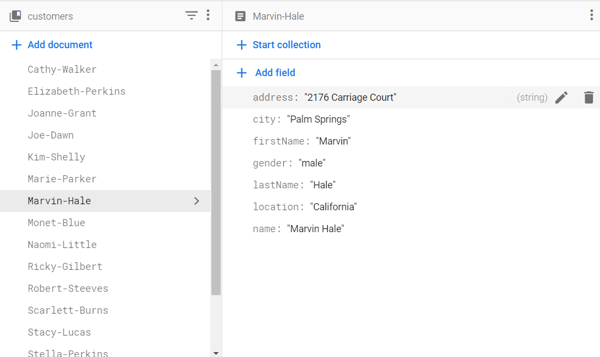
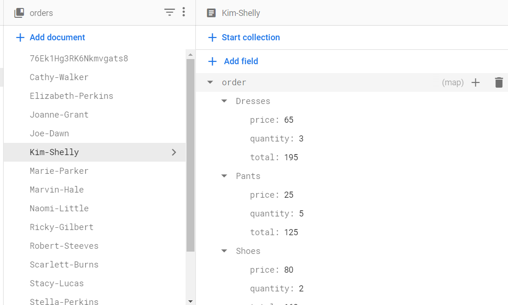

# Customer Order                                                                      
**Stack:** *Angular (SASS), Firestore*                                    
      
#### **Objective 📈:** Create an Angular app that manipulates data, utilizes lazy loading, and incorporates child routing.
**Purpose:** To learn what a true developer does day in and day: work with data. Making API calls and updating states is crucial for
any user experience. 
 
 
**Requirements** 🚦
*•Must have an angular service that incorporates firestore and CRUD actions 
•Must have routing with unique child routes
•Must have scalable architecture*
 
 
**Data Finished (Version 1):** 4/6/2022 

# App Architecture
.png)

# Firestore Database Structure
## Customers

## Orders

 
**What's the most technically challenging part of this project and why?**
The most challenging part was app architecture. I struggled because I exported modules incorrectly and made large components with too much logic. 
 
Thanks to Touhid Rahman's guide on Angular App architecture, (https://javascript.plainenglish.io/how-to-structure-angular-apps-in-2021-a0bdd481ad0d)
I was able to connect all the dots and see how Angular truly works.
 
 
##Realizations ⌛️
• Components should be simple and should focus on doing one thing very well. Doing this allows easier testing, debugging, and understanding of the app.
• Child routes must be independent and cannot grab logic from parent routes. This would defeat the purpose of lazy loading and bookmarking links.
• Database structures affect the complexity of code. In my case, I had to iterate the orders collection three times because I added an unnecessary map(an array with nested array of objects inside) to firestore

